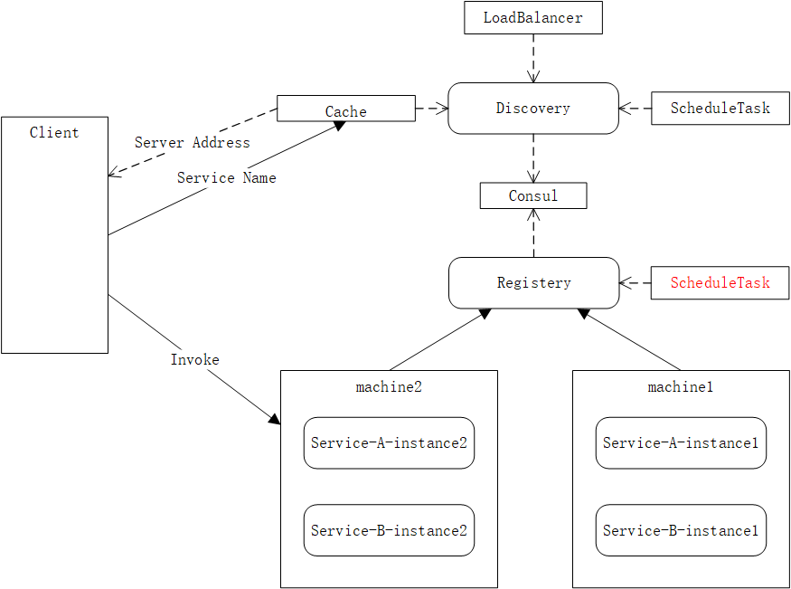

# A simple RPC implemented by Scala

High performance RPC framework based on HTTP/2 Protocol, Consul, Guice, Netty Transport and Protostuff Serialization.

If you want to join this project, please contact me by email.（想加入本项目的请邮件联系我）

    You'd better know what technologys Java Scala SBT RPC are

* Java 8
* Scala 2.12.7

[](https://travis-ci.org/jxnu-liguobin/dlsRpc)


Already Implemented functions
---

- Remote Call base on NIO （基于 NIO 的远程调用）
- Service Discovery （基于 consul-api 的服务发现）
- Service Registration base on annotation （基于自定义注解的服务注册）
- Server-side LoadBalancing with Random, Weight or Hash IP （基于随机、权重、权重 & HASH IP 的服务端负载均衡）
- Automatic switching between CGLIB and JDK proxy （自动切换 CGLIB、JDK 动态代理）
- Dependency Injection base on Guice
- Serializer base on Protostuff
- Call chaining
- Multi-module project base on SBT
- Pressure measurement base on JMH
- Configuration injection base on typesafe Config
- Services can be configured and configuration file can be configured
- Client Configuration Caching and Timely Refresh
 - loading  
 
Component
---



Technology
---

* Netty 
* Http2
* Protostuff
* Jmh
* Guice
* Consul
* Cglib
* Typesafe Config
* Guava Cache

Test & Use
---

- git clone  ```git@github.com:jxnu-liguobin/dlsRpc.git```
- sbt compile
- import use IDEA
- run sbt task in sbt shell: publishM2 

        
        Default jar files storage repository is "C:/userName/.m2/repository/io/growing/dlsrpc-*_2.12/1.0.13/*.jar"
        If your maven local repository  is different from this, you need to move all the jar files to your own repository.
        
- refresh maven module named benchmark

Examples
---

- server 

```java
//you need start a consul
//start server
public class ServerBuilderTest {
    public static void main(String[] args) {
        List<Object> tmpList1 = new ArrayList<>();
        tmpList1.add(new HelloWorld());
        ServerBuilder server = DlsRpc.getServerBuilder(9000, tmpList1);
        server.build().start();
    }
}
//service product
@RPCService
public class HelloWorld {

    public String sayHello(String name) {
        return name.concat("-hello!");
    }

}
```
- client

```java
//start client
//no super interface
HelloWorld hello = DlsRpc.getClientBuilder(HelloWorld.class).build();
```

Benchmark
---

- Condition 

| Title | Value |
| --- | --- |
| CPU | i5 7300HQ |
| Memory | 12G DDR4(2400MHz) |
| Threads | 35 |

- Details

| Benchmark | Mode | Cnt | Score | Error | Units |
| --- | --- | --- | --- | --- | --- |
| dlsRpc.JmhClient.JmhClient | Throughput |  20 | 25.144 ± 1.576 |  | ops/ms |
| dlsRpc.JmhClient.JmhClient | Average time |  20 | 1.339 ± 0.029 |  | ms/op |
| dlsRpc.JmhClient.JmhClient | Sampling time |  571301 | 1.309 ± 0.005 | | ms/op |
| dlsRpc.JmhClient.JmhClient | Single shot invocation time |   |  2567.914 |   | ms/op |

[@NettyRPC](http://www.cnblogs.com/jietang/p/5675171.html) [@grpc](https://github.com/grpc/grpc-java) [@Reference Java Edition](https://github.com/yeyincai/flashRPC)

[@NioEventLoopGroup](https://www.jianshu.com/p/2e3ae43dc4cb) [@consul-api](https://github.com/Ecwid/consul-api) [@EnableEurekaClient Source Analysis](https://www.cnblogs.com/zhangjianbin/p/6616866.html)

